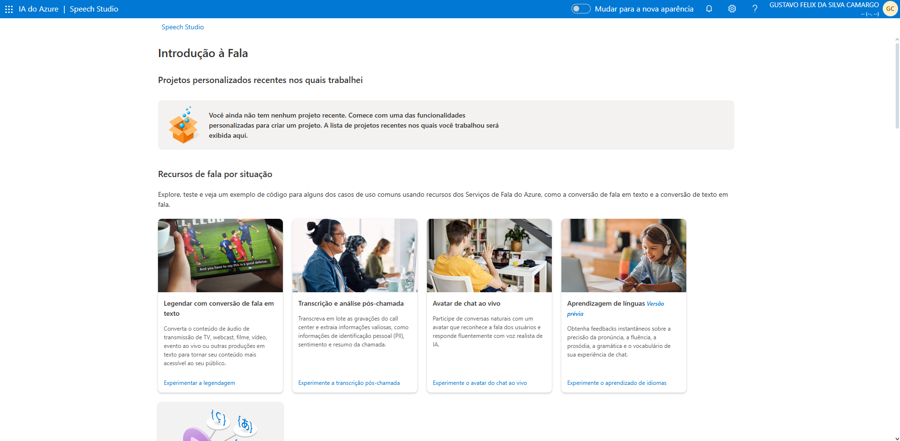
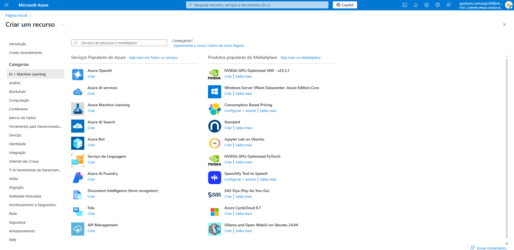

# Análise de Sentimentos com Language Studio no Azure AI

## Aviso Prévio

* **Apesar de não possuir uma conta ativa na Microsoft Azure, adquiri conhecimento sobre o uso do Microsoft Speech Studio e Microsoft Language Studio por meio de vídeo aulas e materiais complementares disponibilizados pela plataforma DIO.**

### Pré-requisitos

* Ter acesso a uma conta Microsoft Azure - **Não Possuo**

* Ter um computador

# **Conhecendo o Estudio de fala**

Aprendi a utilizar o recurso de conversão de fala em texto no Microsoft Speech Studio, explorando a criação de legendas automáticas para áudios e vídeos em tempo real. É mostrado em fontes externas a configuração de reconhecimento de fala com o SDK da Microsoft, ajustando opções como lista de frases para melhorar a precisão da transcrição. Onde também é apresentado a possibilidade de integração com conteúdos de áudio ao vivo ou gravados, como chamadas telefônicas, podcasts e transmissões esportivas. Além disso, compreendi que é possível personalizar o uso da ferramenta com diferentes planos de cobrança, sendo que dependendo do modelo, pode variar o custo.

# **Conhecendo o Estudio de fala**

Aprendi a utilizar o Microsoft Language Studio para aplicar processamento de linguagem natural (PLN) em diferentes tipos de texto, explorando recursos como análise de sentimentos, extração de entidades e classificação personalizada. Durante o processo, é possível ver projetos com dados próprios e experimentei modelos pré-treinados para realizar tarefas específicas, como identificar opiniões em comentários ou detectar tópicos em documentos.

## Links Importantes - Disponibilizados durante o desafio

* [**Documentação da Microsoft AI Learning**](https://aka.ms/ai900-speech)
* [**Documentação da Microsoft AI Learning**](https://aka.ms/ai900-text-analysis)

## **Conhecendo o Language Studio**

Projeto desenvolvido durante o [**Bootcamp Suzano - Python Developer**](https://www.dio.me/bootcamp/suzano-python-developer), oferecido pela [**DIO**](https://www.dio.me/)

##

- Realizado por [Gustavo Félix](https://github.com/Gustavo-Felix)
